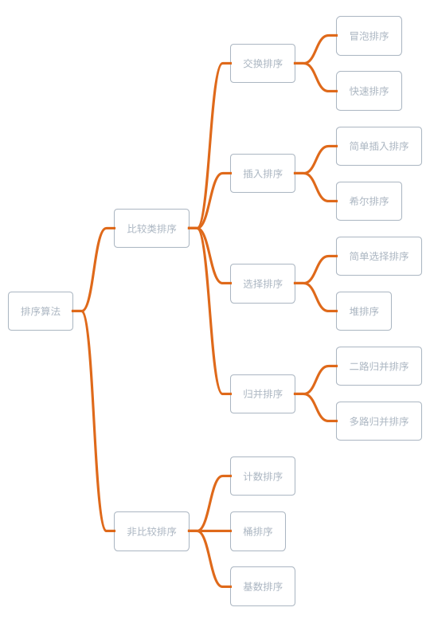

## 排序算法分类

1. 基于比较的排序

通过比较大小来决定元素间的相对次序
可以证明时间复杂度下界为 O(NlogN) -- 不可能突破这个复杂度达到更快

2. 非比较类排序

不通过比较大小来决定元素间的相对次序
时间复杂度受元素的范围以及分布等多种因素影响，不单纯取决于元素数量 N



### 初级排序算法

**选择排序**（Selection Sort）-- ”该放哪个数了？“

每次从未排序数据中找最小值，放到已排序序列的末尾

**插入排序**（Insertion Sort） -- ”这个数该放哪儿？“

从前到后依次考虑每个未排序数据，在已排序序列中找到合适位置插入

**冒泡排序**（Bubble Sort）

不断循环扫描，每次查看相邻的元素，如果逆序，则交换

以上算法时间复杂度均为 O(N^2)

### 堆排序

堆选排做优化，既然你要取 min，又是维护一个集合，很自然就想到了堆

堆排序（Heap Sort）是对选择排序的优化 -- 利用二叉堆高效的选出最小值

建立一个包含所有 N 个元素的二叉堆，重复 N 次从堆中取最小值，即可得到有序序列

时间复杂度为 O(NlogN)

```cpp
void heap_sort(int a[],int n){
        // 默认大根堆,加负数，变成小根堆
        priority_queue<int> q;
        for(int i=0;i<n;i++){
                q.push(-a[i]);
        }
        for(int i=0;i<n;i++){
                // 负回来
                a[i] = -q.top();
                q.pop();
        }
}
```

### 希尔排序

希尔排序（Shell Sort）是对插入排序的优化 -- 增量分组插入排序

希尔排序的时间复杂度取决于增量序列（步长序列）的选取

目前已知的最好序列可以做到 O(N^(4/3))或 O(Nlog^2N)

### 归并排序

归并排序（Merge Sort）是一个基于分治的算法

时间复杂度 O(NlogN)

原问题：把数组排序
子问题： 把数组前一半，后一半分别排序
然后再合并左右两半（两个有序数组）就可以了

```java
public static void mergeSort(int[] arr, int l, int r){
        if(l>=r) return;
        int mid = (l+r)>>1;
        mergeSort(arr, l, mid);
        mergeSort(arr,mid+1,r);
        // 合并两个有序数组
        merge(arr,l,mid,r);
}

static void merge(int[] arr,int left,int mid,int right){
        int[] temp = new int[right-left+1];
        int i = left,j = mid+1;
        // 合并两个有序数组
        for (int k =0;k<temp.length;k++){
                if(j>right||(i<=mid&&arr[i]<=arr[j])){
                        temp[k] = arr[i++];
                }else{
                        temp[k] = arr[j++];
                }
        }
        // 拷回原数组
        for(int k=0;k<temp.length;k++){
            arr[left+k] = temp[k];
        }
}
```

912. Sort an Array

Given an array of integers nums, sort the array in ascending order and return it.

You must solve the problem without using any built-in functions in O(nlog(n)) time complexity and with the smallest space complexity possible.

Example 1:

```
Input: nums = [5,2,3,1]
Output: [1,2,3,5]
Explanation: After sorting the array, the positions of some numbers are not changed (for example, 2 and 3), while the positions of other numbers are changed (for example, 1 and 5).
```

Example 2:

```
Input: nums = [5,1,1,2,0,0]
Output: [0,0,1,1,2,5]
Explanation: Note that the values of nums are not necessairly unique.
```

Constraints:

- 1 <= nums.length <= 5 \* 104
- -5 _ 104 <= nums[i] <= 5 _ 104
